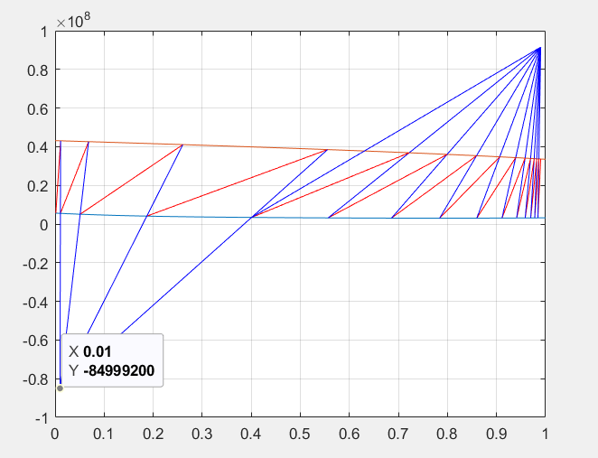
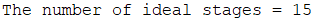

# Panchon-Savarite-Unit-Operations
The Ponchon-Savarit method is a graphical distillation design approach using H-x diagrams to combine mass and energy balances. It provides a more detailed analysis than McCabe-Thiele by including enthalpy effects but is limited to binary systems, assumes equilibrium stages, and often neglects non-idealities and multicomponent separations

In this project you can draw panchon savarite method and then count numbers of stages for your own system.I have done a sample.

You can see methanol system and its stages to reach the given composition.Also this code counts this stages by counting  tie_lines.you can see in the below:

It shows that you can enter your desired systems data and then reach to this systems stages by solving by Panchon_savarite method.
